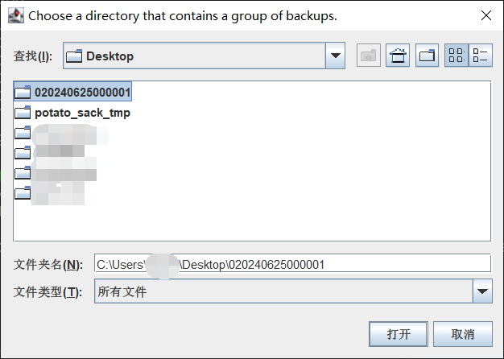
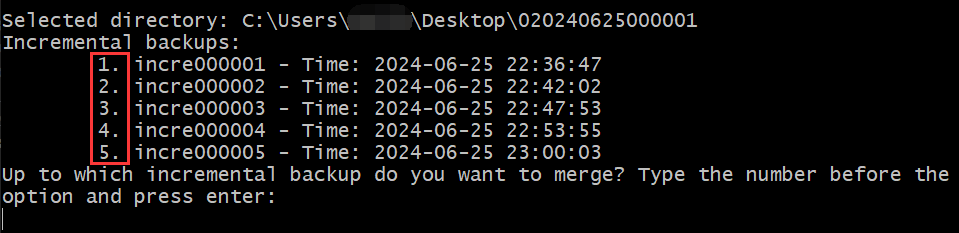

# Backups Merger

A tool to merge **a group of backups** into a full backup.

## Usage

1. Download `BackupsMerger*.jar` at [here](https://github.com/Bottle-M/PotatoSack/releases/latest).  
2. Download the group of backups you want to restore from the cloud backup directory, unzip them and extract the directory structure as shown below.    

    ```text
    020240625000001/
    ├── _world.json
    ├── _world_nether.json
    ├── backup.json
    ├── full.zip
    ├── incre000001.zip
    ├── incre000002.zip
    ├── incre000003.zip
    ├── incre000004.zip
    └── incre000005.zip  
    ```

3. Execute `java -jar BackupsMerger*.jar`。

4. After starting the program, you can press Enter to select the directory where the backup group is located, or you can type `exit` to exit the program.  
   
      

    Select Backup Group:  

      

5. The program works by sequentially merging incremental backups (`incre*.zip`) with the full backup (`full.zip`). However, we may not always want to merge all the incremental backups. Therefore, the program will ask up to which incremental backup do you want to merge (input the number before the option).

      

6. Next, the program will prompt the user to choose where to save the final merged zip archive.   

      

7. The program will generate a merged zip archive (default filename is `merged.zip`). You can extract this package to your Minecraft server directory to restore your world data.  