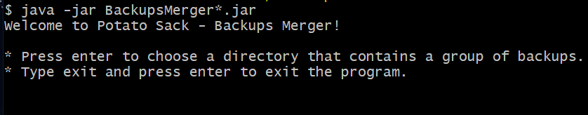
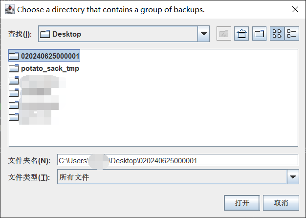
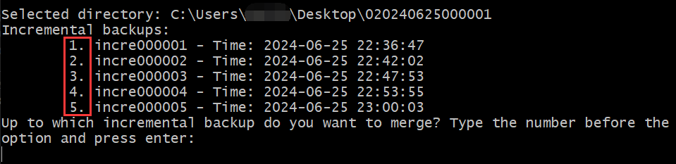
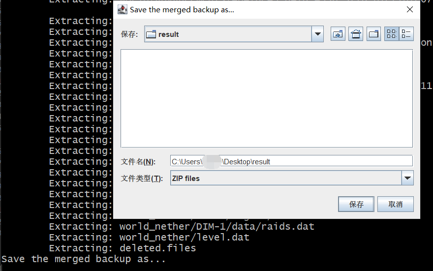

# Backups Merger

将**一组备份**合并成一个完整的备份的小工具。

## 用法

1. 在[这里](https://github.com/Bottle-M/PotatoSack/releases/latest)下载 `BackupsMerger*.jar`。  
2. 从云端备份目录中下载你想恢复的一组备份，解压，解压后目录结构如下方所示。  

    ```text
    020240625000001/
    ├── _world.json
    ├── _world_nether.json
    ├── backup.json
    ├── full.zip
    ├── incre000001.zip
    ├── incre000002.zip
    ├── incre000003.zip
    ├── incre000004.zip
    └── incre000005.zip  
    ```

3. 运行 `java -jar BackupsMerger*.jar`。

4. 启动程序后，你可以按下回车以选择备份组所在的目录，也可以输入 `exit` 以退出程序。

      

    选择备份组所在目录：  

      

5. 程序的工作是按顺序将增量备份 `incre*.zip` 与全量备份 `full.zip` 合并，但是我们有时候并不一定想要合并所有的增量备份，因此程序会询问，至多合并到哪一次增量备份。（输入选项前的序号）  

      

6. 随后，程序会让用户选择将最终合并出的 Zip 包保存在哪里。  

      

7. 最终程序会产生一个合并后的 Zip 包，默认文件名是 `merged.zip`。你可以把这个压缩包解压到你的 Minecraft 服务端目录以恢复世界数据。  