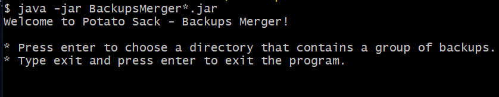
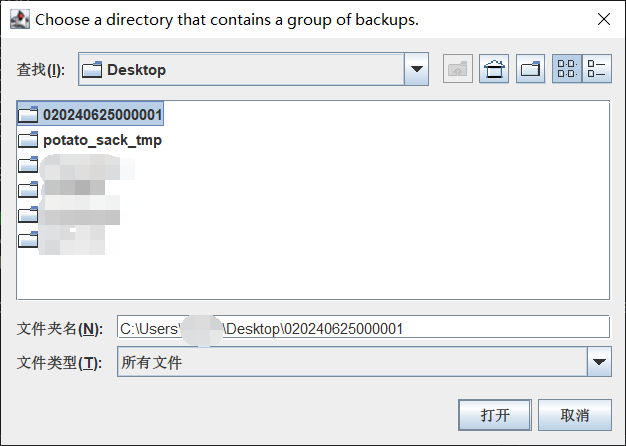
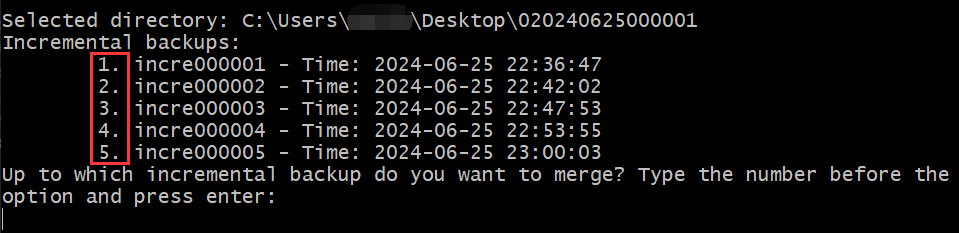
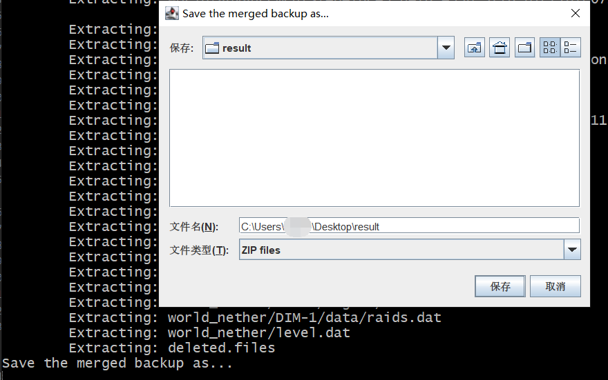

# Backups Merger

将**一组备份**合并成一个完整的备份的小工具。

> **该用哪个版本？** 从 PotatoSack 3.0.0 起，增量备份里的 `.mca` **只存储发生变动的区块**（即看上去是 `.mca`，实际上是 PotatoSack 的 `PSMCA` delta 格式），因此恢复 3.0.0 的增量备份组需要使用 **BackupsMerger 1.1.0 或更新版本**。增量包里以完整 `.mca` 存放的文件仍可原样合并。  
> BackupsMerger 仍然支持合并旧的增量备份（3.0.0 之前的版本），这些备份里存放的是完整的区域 `.mca` 文件。

## 用法

1. 在[这里](https://github.com/Bottle-M/PotatoSack/releases/tag/backups-merger-v1.1.0)下载 `BackupsMerger*.jar`。  
2. 从云端备份目录中下载你想恢复的一组备份，解压，解压后目录结构如下方所示。  

    ```text
    020240625000001/
    ├── _world_<hash>.bin
    ├── _world_nether_<hash>.bin
    ├── backup.json
    ├── full.zip
    ├── incre000001.zip
    ├── incre000002.zip
    ├── incre000003.zip
    ├── incre000004.zip
    └── incre000005.zip  
    ```

    > `_*.bin` 是插件的目录记录文件（PotatoSack 3.0.0 之前为 `.json` 文件）。合并器**不会**读取它们，合并时只需要 `backup.json` 和各个 Zip 包。

3. 运行 `java -jar BackupsMerger*.jar`。

4. 启动程序后，你可以按下回车以选择备份组所在的目录，也可以输入 `exit` 以退出程序。

      

    选择备份组所在目录：  

      

5. 程序的工作是按顺序将增量备份 `incre*.zip` 与全量备份 `full.zip` 合并，但是我们有时候并不一定想要合并所有的增量备份，因此程序会询问，至多合并到哪一次增量备份（输入选项前的序号）。  

      

6. 随后，程序会让用户选择将最终合并出的 Zip 包保存在哪里。  

      

7. 最终程序会产生一个合并后的 Zip 包，默认文件名是 `merged.zip`。你可以把这个压缩包解压到你的 Minecraft 服务端目录以恢复备份数据。  

## 各类条目的合并方式说明

| 压缩包中的条目                                                  | 处理方式 |
|----------------------------------------------------------| --- |
| 普通文件（`.dat`、`.mcc` 等）                                    | 原样解压、覆盖目标文件 |
| 存放完整区域文件的 `.mca`（`full.zip` 中总是如此；增量备份时因读取失败退化为原样打包的文件也是如此） | 原样解压、覆盖目标文件 |
| 以 `PSMCA\0` 开头的 `.mca`（3.0.0 的增量 delta 格式，只含变动区块）         | 读取前面备份已经恢复出来的区域文件作为基线，把 delta 应用进去，重新生成完整的 Anvil 区域文件后再覆盖 |
| `deleted.files`                                          | 该增量包的其余条目都处理完之后，按清单逐行删除文件；清单本身随后也会被删除，不会残留到最终合并产出的 `.zip` 中 |

* delta 里没有记录的区块沿用此前状态；同一个区域文件可以连续应用多份 delta。
* delta 中扇区数为 `0` 的区块会从区域文件中删除。
* `.mcc` 按普通文件处理：`.mca` 里对于 `.mcc` 这种外置区块仍会保留一个特殊存根标记这个区块是外置的。
* 每个 `.mca` 都是先写到临时文件、再由临时文件原子替换目标文件，因此失败不会留下写了一半的区域文件。

## 出错排查

| 提示信息 | 含义                                                               |
| --- |------------------------------------------------------------------|
| `Full backup contains an incremental (PSMCA) region entry: ...` | `full.zip` 里出现了 delta 形式的 `.mca`。全量备份必须原样存储区域文件，说明这个备份组有问题。 |
| `Incremental region entry ... is a PSMCA delta, but there is no baseline region file at ...` | 该增量需要用到前面备份恢复出的区域文件作为基线。可能备份数据发生了损坏。        |
| `Invalid delta file ...: payload of chunk #N ... is truncated` / `... trailing byte(s) ...` / `... appears more than once` | 该增量包已损坏（上传/下载不完整），请重新下载对应的 `incre*.zip`。                         |
| `Invalid base region file ...` | 工作目录里已有的 `.mca` 不是完整的区域文件。                                       |
| `Refusing zip entry: ...` | 压缩包里存在绝对路径或含 `..` 的条目，会写到工作目录之外，合并中止。                            |
| `Ignoring unsafe path in deleted.files: ...` | 清单里有一行指向恢复目录之外，该行被跳过。                                            |

如果合并失败，程序会报出报错信息，不会生成输出压缩包。  
