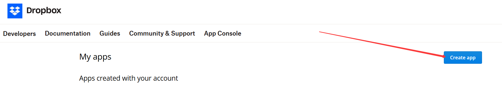
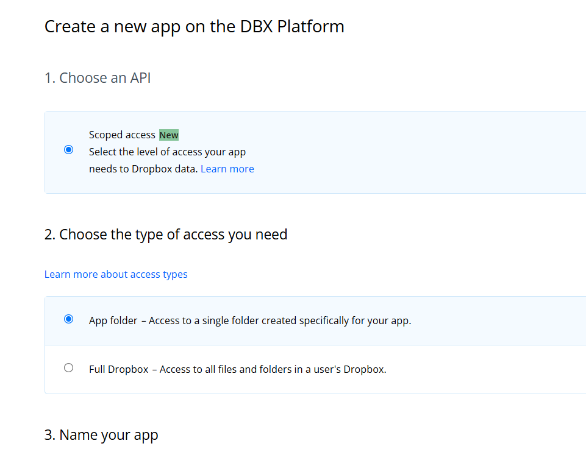
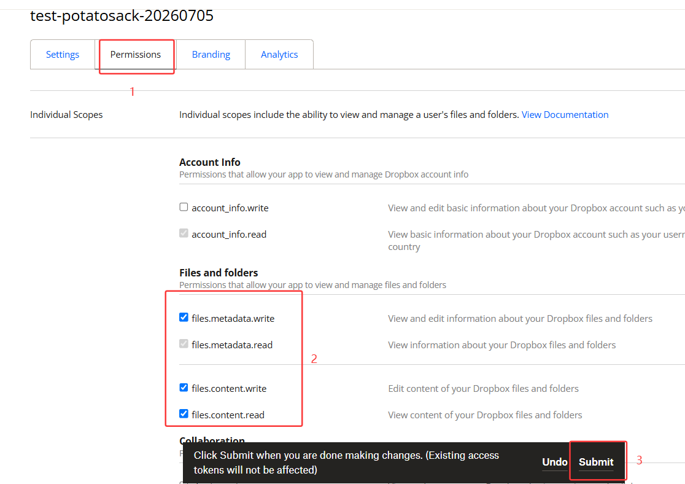
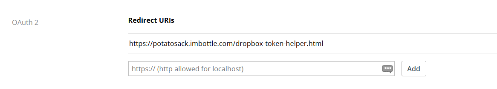
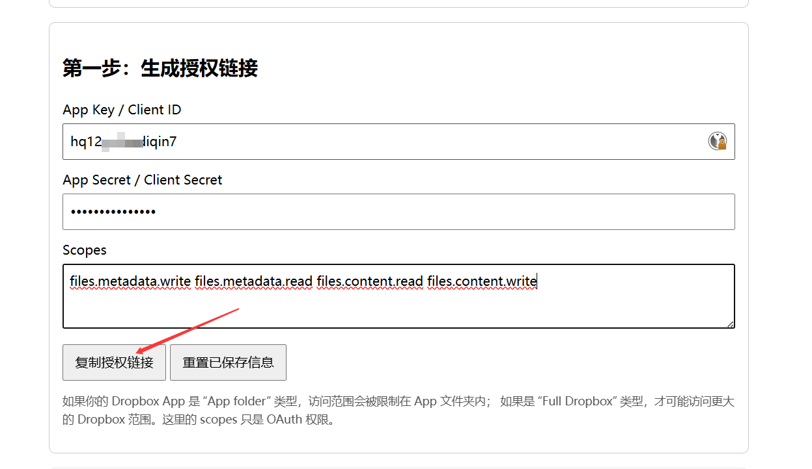
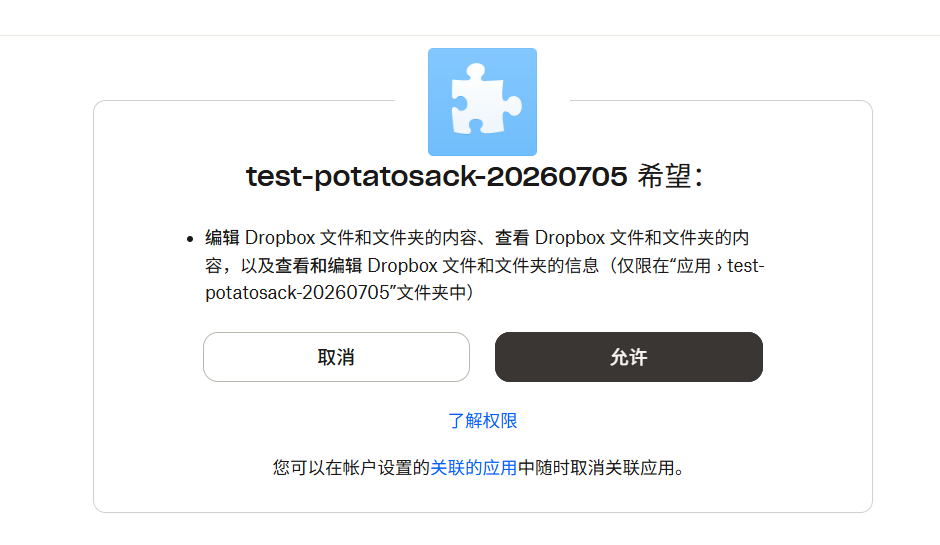
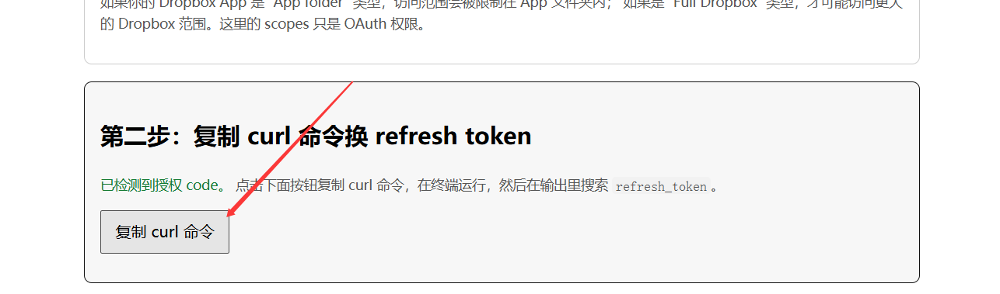
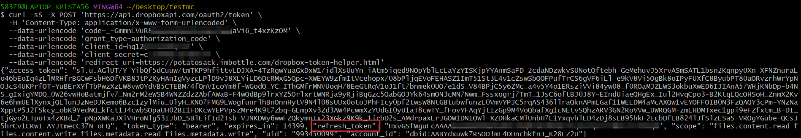

# Dropbox 应用注册与配置引导

* [English Version](#eng)  

本文档将会详细说明如何注册 Dropbox 应用并获取 `refresh_token`。  

## 1. 应用注册

1. 访问 Dropbox 开发者应用控制台: https://www.dropbox.com/developers/apps, 点击 **Create App** 开始新建一个应用:  

      

2. 选择你想创建的应用类型并填写应用名字，创建应用:  

      

    * 和 OneDrive 一样是有 Full 和 App Folder 两种访问范围的，这里还是强烈建议只能访问应用目录，以确保数据隔离性，提升安全性。  

## 2. 配置应用权限

在应用面板的 **Permissions** 选项卡下勾选权限，然后提交：  

  

通常需要下面四个权限：  

* `files.metadata.read`
* `files.metadata.write`
* `files.content.read`
* `files.content.write`

## 3. 添加重定向 URI

在应用面板的 **Settings** 选项卡下的 `OAuth 2` 一节添加重定向 URI (https://potatosack.imbottle.com/dropbox-token-helper.html)：  

  

* 应用授权后会带着必要信息跳转回这个 URI。  

## 4. 获得 App Key 和 App Secret

在应用面板的 **Settings** 选项卡下可以找到 App Key 和 App Secret，复制即可。  

## 5. 获取 Refresh Token

1. 在地址栏访问 https://potatosack.imbottle.com/dropbox-token-helper.html, 在第一步模块中填入我们刚才收集到的信息，然后点击**复制授权链接**:  

      

2. 复制授权链接后在另一个窗口打开，然后建议你刚刚注册应用的账户进行登录，登录完成后授权应用：  

      

3. 授权完成后会跳转回刚才的页面，现在可以复制 curl 命令了：  

      

4. 复制命令，在支持 curl 工具的终端执行，在输出的结果中你就可以找到 `refresh_token` 了：  

      

## 6. 编辑插件配置

现在你就可以编辑 `configs.yml`，填入相应信息了！

---

# Dropbox App Registration & Configuration Guide

This document explains how to register a Dropbox application and obtain a `refresh_token`.

## 1. App Registration

1. Go to the Dropbox Developer App Console: https://www.dropbox.com/developers/apps, click **Create App** to start:

    

2. Choose the type of app you want and fill in the app name, then create it:

    

    * Like OneDrive, Dropbox offers **Full** and **App Folder** access scopes. We strongly recommend using App Folder only — this ensures data isolation and improves security.

## 2. Configure App Permissions

Under the **Permissions** tab in the app dashboard, check the required permissions and submit:

You'll typically need these four permissions:

* `files.metadata.read`
* `files.metadata.write`
* `files.content.read`
* `files.content.write`

## 3. Add Redirect URI

Under the **Settings** tab, in the `OAuth 2` section, add the redirect URI (`https://potatosack.imbottle.com/dropbox-token-helper.html`):

* After authorization, the browser will redirect here with the necessary parameters.

## 4. Get App Key & App Secret

Both are shown under the **Settings** tab — copy them from there.

## 5. Get Refresh Token

1. Go to https://potatosack.imbottle.com/dropbox-token-helper.html. In the first step, fill in the information you just collected, then click **复制授权链接** to copy a URL for authorization:

    

2. Open the copied link in a new window. Sign in with the account you registered the application under, then authorize the app:

    

3. After authorization, you'll be redirected back to the helper page. Now you can copy the curl command:

    

4. Run the copied command in a terminal that supports curl. In the output, you'll find the `refresh_token`:

    

## 6. Edit Plugin Configuration

Now you can edit `configs.yml` and fill in all the information!