# OneDrive 应用注册与配置引导

* [English Version](#eng)  

本文档将会详细说明如何注册 OneDrive 应用并获取 `refresh_token`。  

## 1. 应用注册

1. 登录 Microsoft Entra 平台：https://entra.microsoft.com/#home, 在导航栏找到应用注册（App Registrations）入口：  

    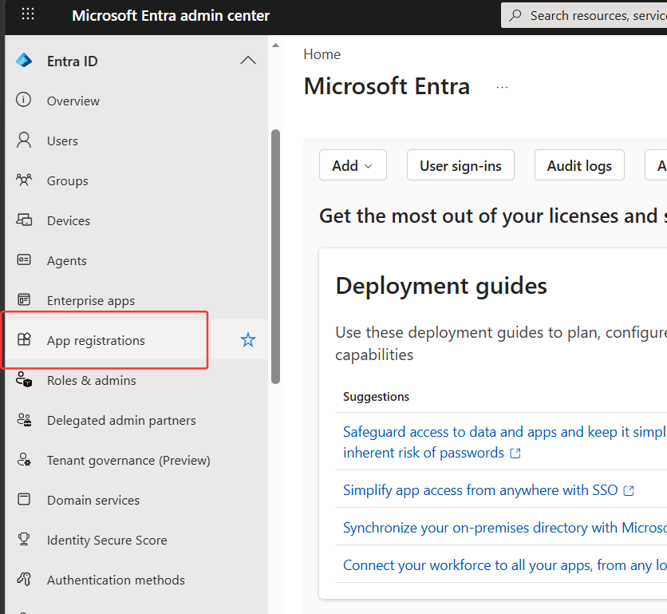  

2. 注册新应用：  

    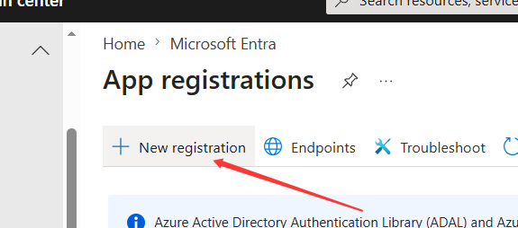  

3. 填写注册信息，注册应用：
   
    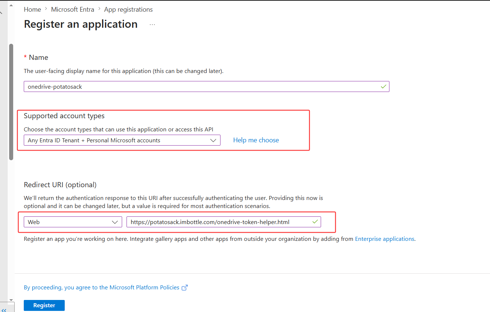   

    * 名字自己随便起一个即可；
    * 其中账户类型请选择 `Any Entra ID Tenant + Personal Microsoft Accounts`（任意 Entra 租户 + 个人 Microsoft 账号），这样就算你是用的个人微软账号，也能正常访问这个 APP；  
    * Redirect URI 选择 Web 类型，填入 `https://potatosack.imbottle.com/onedrive-token-helper.html`，后面步骤成功登录并授权给应用后会带着必要信息跳转到这个 URI。  

## 2. 配置 API 权限

1. 在应用视图左侧导航栏找到 API 权限（API Permissions），进入权限管理面板，新增一个权限，选择 Microsoft Graph -> 委派权限（Delegated Permissions）：  

    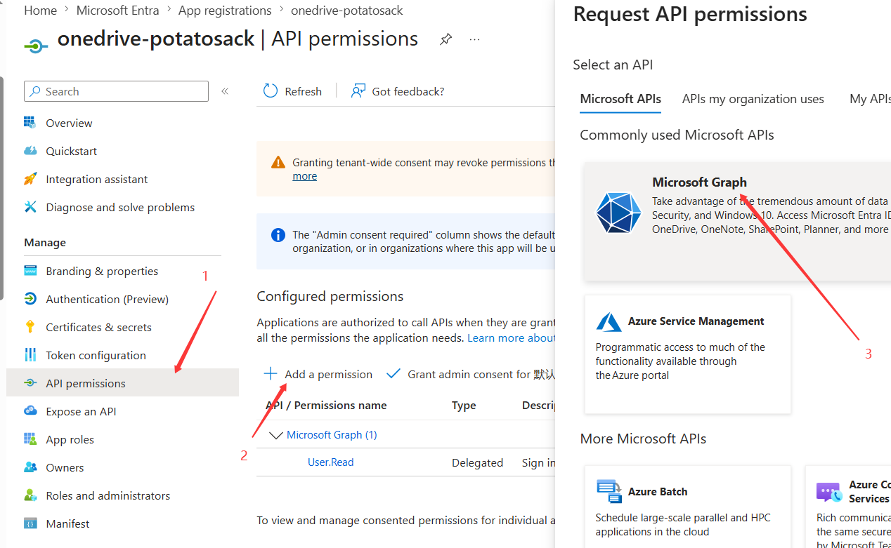  

    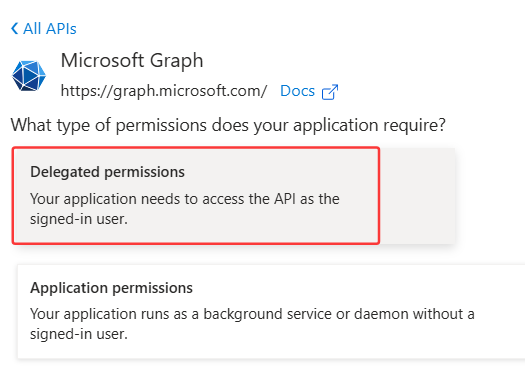  

    > 委派权限指的是代表用户身份去调用 API 的权限，采用委派权限，才知道访问 OneDrive 时访问的是谁的文件。  

2. 搜索 `Files.`，读方面，先选择 `Files.Read` 权限；写入方面，如果你采用 App Folder，请选择 `Files.ReadWrite.AppFolder`，否则请选择 `Files.ReadWrite.All`：  

    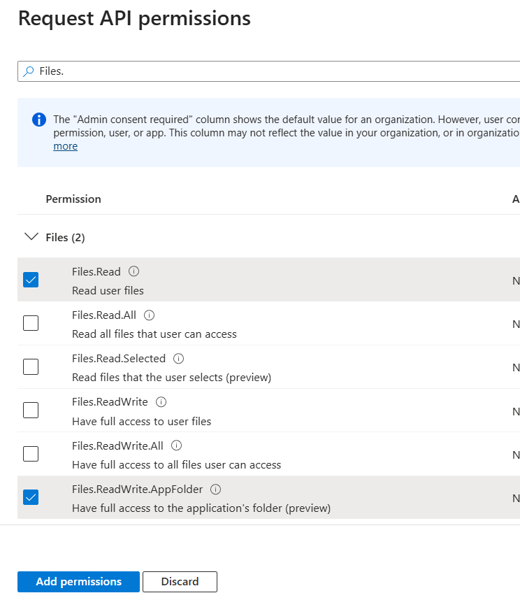  

    > 注：使用 OneDrive 企业版（ODB）时，如果使用 `Files.ReadWrite.AppFolder` 有无法写入文件的问题，请再添加 `Files.ReadWrite.All` 权限。  

3. 搜索 `offline_access`，添加这个权限：  

    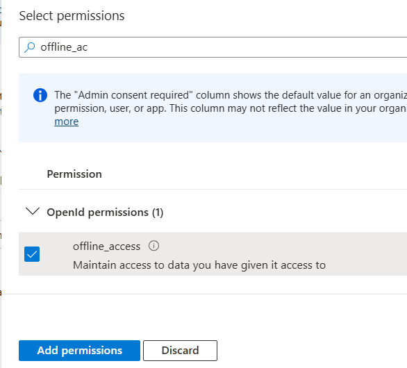  

    > 如果不选择这个权限，是无法获取到 `refresh_token` 的。  

4. 操作完后你应该有 `Files.Read`, `offline_access`, `Files.ReadWrite.AppFolder` / `Files.ReadWrite.All` 权限

## 3. 创建 Client Secret

在应用左侧导航面板找到证书 & 密钥（Certificates & secrets）进入，在 Client Secret 选项卡下创建新的 Client Secret：  

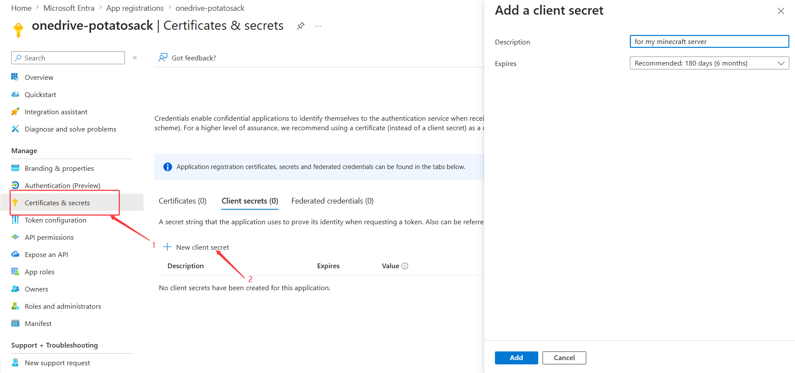  

* 描述可以随便写，过期时间的话，如果比较懒，可以选长一点的时间 (￣3￣)╭，不过到时候别忘了到期更换。  

创建后复制保存密钥：  

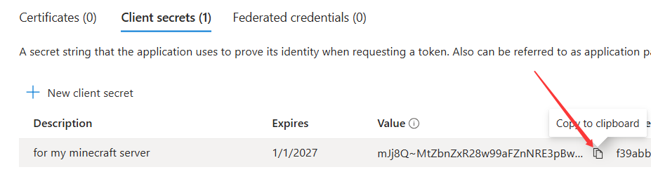  

## 4. 获得 Client ID

在应用面板左侧导航栏点击概览（Overview）进入概览面板，一眼就能看到 Client ID，复制下来：  

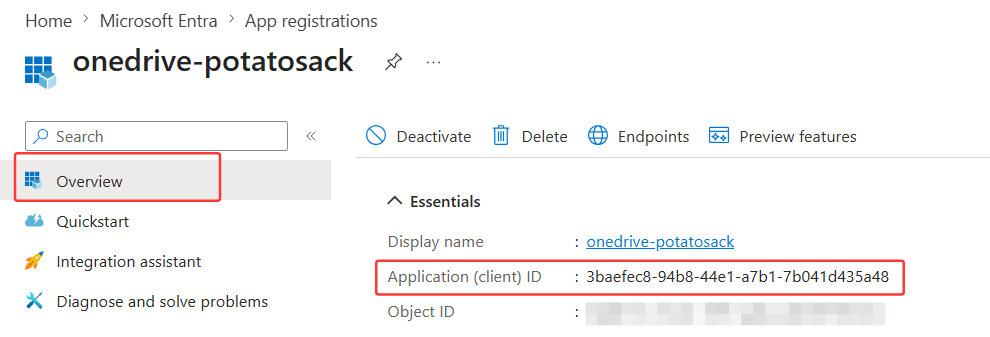  

## 5. 获取 Refresh Token

1. 在地址栏访问 https://potatosack.imbottle.com/onedrive-token-helper.html, 在第一步模块中填入我们刚才收集到的信息，然后点击**复制授权链接**：  

    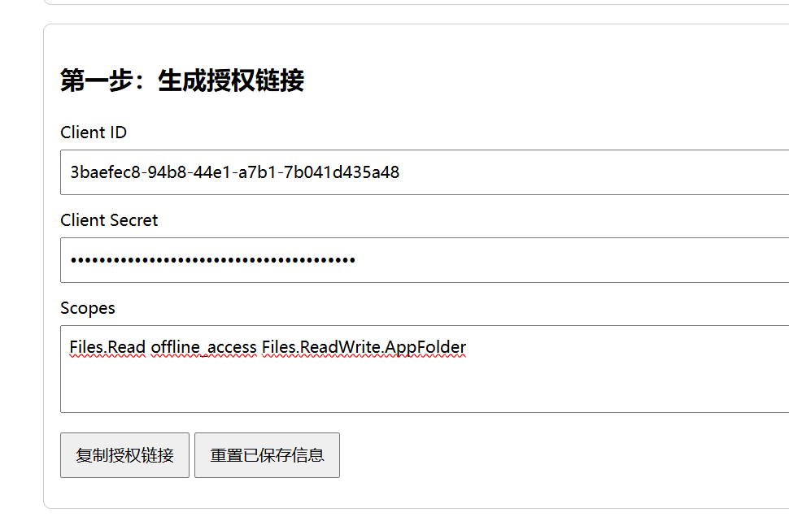  

2. 复制授权链接后在另一个窗口打开，然后建议你刚刚注册应用的账户进行登录，登录完成后授权应用：  

    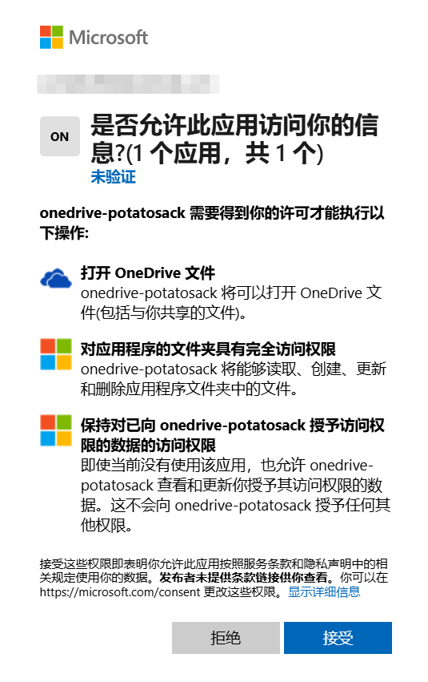   

3. 授权完成后会跳转回刚才的页面，现在可以复制 curl 命令了：  

    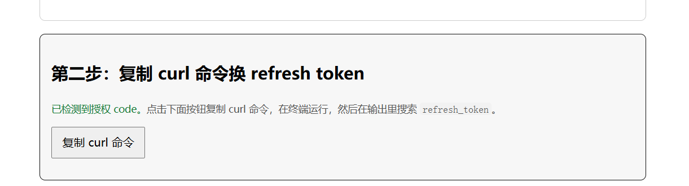  

4. 复制命令，在支持 curl 工具的终端执行，在输出的结果中你就可以找到 `refresh_token` 了：  

    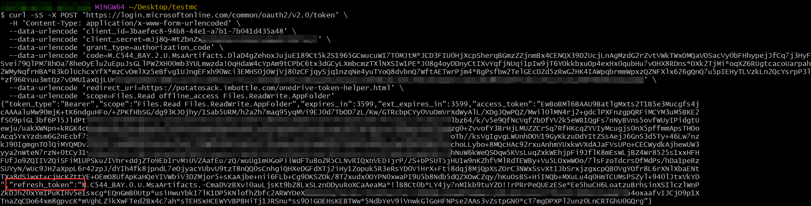  

## 6. 编辑插件配置

现在你就可以编辑 `configs.yml`，填入相应信息了！

---

# OneDrive App Registration & Configuration Guide

This document explains how to register a OneDrive application and obtain a `refresh_token`. 

## 1. App Registration

1. Sign in to the Microsoft Entra platform: https://entra.microsoft.com/#home, find **App Registrations** in the navigation panel:

    

2. Register a new application:

    

3. Fill in the registration form:

    

    * Choose any name you like;
    * For **Account types**, select `Any Entra ID Tenant + Personal Microsoft Accounts` — this lets both personal Microsoft accounts and work/school accounts access the app;
    * Set **Redirect URI** to Web type, enter `https://potatosack.imbottle.com/onedrive-token-helper.html`. After successful login and authorization, the browser will redirect here with necessary parameters.

## 2. Configure API Permissions

1. In the left navigation panel, find **API Permissions**, click **Add a permission**, select **Microsoft Graph** → **Delegated Permissions**:

    

    

    > Delegated permissions let the application act on behalf of the signed-in user, so the API knows whose OneDrive files to access.

2. Search for `Files.`. For read access, check `Files.Read`. For write access, choose `Files.ReadWrite.AppFolder` if you are using App Folder, or `Files.ReadWrite.All` otherwise:

    

    > Note: When using OneDrive for Business (ODB), if `Files.ReadWrite.AppFolder` has trouble writing files, please also add `Files.ReadWrite.All`.

3. Search for `offline_access` and add it:

    

    > Without this permission, you won't be able to obtain a `refresh_token`.

4. You should now have `Files.Read`, `offline_access`, and either `Files.ReadWrite.AppFolder` or `Files.ReadWrite.All`.

## 3. Create Client Secret

In the left navigation panel, go to **Certificates & secrets**, under **Client Secrets**, create a new secret:

* You can set any description. For expiry, choose a longer duration if you prefer less frequent maintenance :p — just remember to rotate it before it expires.

Once created, copy and save the secret:

## 4. Get Client ID

In the left navigation panel, click **Overview**. The **Client ID** is displayed right on the page — copy it:

## 5. Get Refresh Token

1. Go to https://potatosack.imbottle.com/onedrive-token-helper.html. In the first step, fill in the information we just collected, then click **复制授权链接** to copy a URL for authorization:

    

2. Open the copied link in a new window. Sign in with the account you registered the application under, then authorize the app:

    

3. After authorization, you'll be redirected back to the helper page. Now you can copy the curl command:

    

4. Run the copied command in a terminal that supports curl. In the output, you'll find the `refresh_token`:

    

## 6. Edit Plugin Configuration

Now you can edit `configs.yml` and fill in all the information!