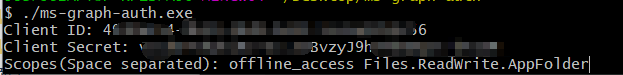
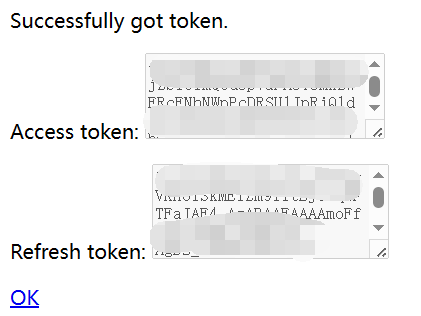
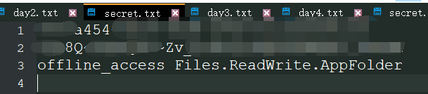

# 简单小工具-令牌获取  

* 注：目前只支持国际版。本工具主要用于获取`RefreshToken`以及`AccessToken`。  

## 前提

1. 在[Azure Portal](https://portal.azure.com/#blade/Microsoft_AAD_RegisteredApps/ApplicationsListBlade)注册应用并配置权限，范例非常多，这里就不多赘述。
    - 比如[AList文档](https://alist.nn.ci/zh/guide/drivers/onedrive.html#%E5%88%9B%E5%BB%BA%E5%BA%94%E7%94%A8)提供的步骤
2. 在第一步配置**Redirect URI（重定向URI）时**请配置为`http://localhost:3072`。
3. 在配置API权限时记住你配置的权限节点，下面在填写`Scopes`字段时会用到。

## 使用方法1

1. 执行`ms-graph-auth.exe` （在Linux上则是`./ms-graph-auth-linux-amd64`）
2. 根据提示输入`Client ID`, `Client Secret`和`Scopes`。
    
    

   - 值得注意的是，`Scopes`是按**空格**分隔。
3. 在弹出的页面中登录微软账号
4. 最后会重定向至`http://localhost:3072`，这里你能拿到`RefreshToken`和`AccessToken`。
   
     
5. 点击“OK”结束进程

## 使用方法2

在上面使用方法的第1步中，逐个在命令行输入太麻烦了，你可以写成一个文件`secret.txt`，其中：
1. 第一行为`Client ID`
2. 第二行为`Client Secret`
3. 第三行为`Scopes`
4. 别忘了在第三行末尾打一个换行符（回车）

   

然后利用输入重定向的方式执行程序：`ms-graph-auth.exe < secret.txt` （在Linux上则是`./ms-graph-auth-linux-amd64 < secret.txt`）

