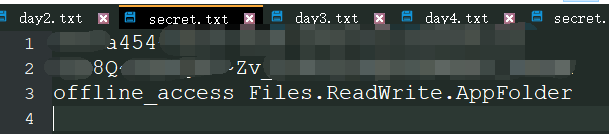

# Small tool - Token Fetcher for OneDrive

* Note: OneDrive 21Vianet version is not currently supported. This tool is mainly used to get `Refresh Token` and `Access Token`.

## Preparation

1. Register an application at [Azure Portal](https://portal.azure.com/#blade/Microsoft_AAD_RegisteredApps/ApplicationsListBlade)。
   
      

    * Use a name you want.
    * Make sure to configure other settings as marked in the red box in the image (this tool will listen on port `3072` locally).  

2. After registering the application, enter the "Certificates and secrets" area in the dashboard, and click "New client secret".

      

    Remember to copy the value of the newly created secret, it will be used as `Client Secret` later.  

3. Go to the "API permissions" area in the Dashboard, Add a permission -> Microsoft Graph -> Delegated permissions. The picture below shows **my recommended** configuration with the `Files.ReadWrite.AppFolder` and `offline_access` permission scopes added.

      

    * "Delegated permissions" restrict the programme to accessing only the files of a particular user. (Application permissions, on the other hand, allow access to the files of all sub-accounts, which is extremely insecure.)  
    * The `Files.ReadWrite.AppFolder` permission allows the application to access only the user's "App" directory and not any other directories. (This means that even if your Client Secret is leaked, an attacker won't be able to access files outside of your application's directory.)
        > Unfortunately, this permission node is currently only supported by OneDrive Personal, and for the Business version, the effect is similar to `Files.ReadWrite.All`.  
    * `offline_access` allows the program to refresh the tokens itself. (With this permission, you **don't** have to re-fetch the `Refresh Token` every so often!)  

4. On the Overview page you can see the Application ID, i.e. the `Client ID`.   
    
      

Once you have completed the steps above, you can see how to use it below.

## Usage 1

1. Execute `ms-graph-auth.exe` (or `. /ms-graph-auth-linux-amd64` on Linux)
2. Enter the `Client ID`, `Client Secret` and `Scopes` as prompted.
    
    

   - It is worth noting that `Scopes` are separated by **spaces**.
3. Sign in to your Microsoft account on the pop-up page.
4. Finally it will redirect to `http://localhost:3072` where you will get the `RefreshToken` and `AccessToken`.  
   
     

5. Click "OK" to end the process.

## Usage 2

In Usage 1 above, it's too cumbersome to enter them one by one at the command line, you can write them as a file `secret.txt`, which:  

1. the first line is the `Client ID`. 
2. the second line is the `Client Secret`. 
3. the third line is `Scopes`. 
4. don't forget to put a line break at the end of the third line.    

   

The programme is then executed using input redirection: `ms-graph-auth.exe < secret.txt` (on Linux `. /ms-graph-auth-linux-amd64 < secret.txt`)  

## In the end 

In fact, there are many similar methods and tools for obtaining OneDrive Tokens, it is not necessary to use this tool.  

* For example, you can check the documentation of [AList](https://alist.nn.ci/zh/guide/drivers/onedrive.html).  