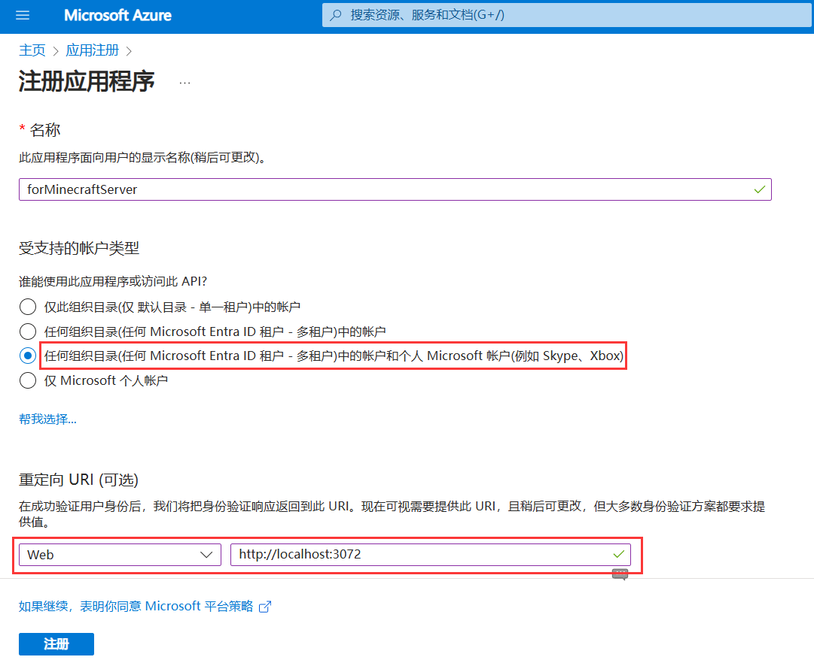
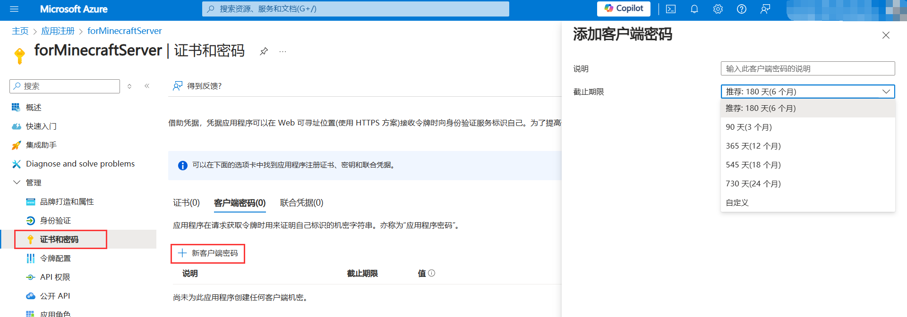
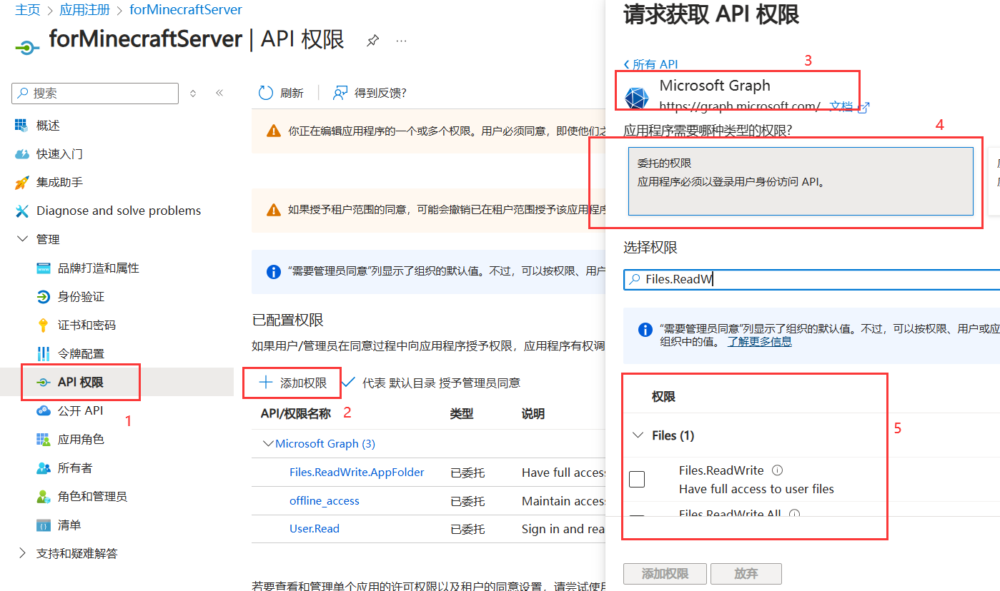
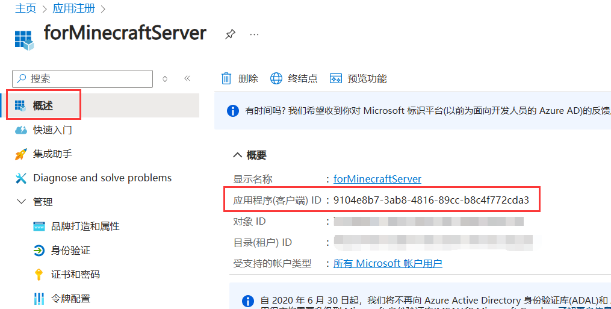
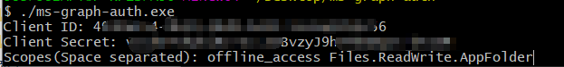
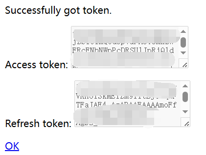
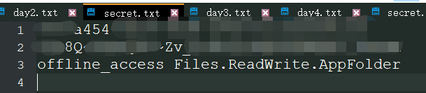

# OneDrive 令牌获取小工具

* 注：目前只支持国际版。本工具主要用于获取 `Refresh Token` 以及 `Access Token`。  

## 前提

1. 在 [Azure Portal](https://portal.azure.com/#blade/Microsoft_AAD_RegisteredApps/ApplicationsListBlade) 注册应用。
   
      

    * 名称自己想一个。
    * 其他地方注意按图中红框标记处进行配置（本工具会在本地监听 `3072` 端口）。

2. 应用注册后进入应用仪表盘的“证书与密码”界面，新键客户端密码。

      

    创建成功后一定要把密码值复制一份，后面用作 `Client Secret`。  

3. 进入应用仪表盘的“API 权限”界面，添加权限 -> Microsoft Graph -> 委托的权限。图中是**我推荐的**配置，添加了 `Files.ReadWrite.AppFolder` 以及 `offline_access` 这两个权限节点。

      

    * “委托的权限”限制程序仅可访问某个用户的文件。（应用程序权限则能访问所有子账户的文件，极其不安全）
    * `Files.ReadWrite.AppFolder` 使得程序只能访问某个用户的“**应用**”目录，而不能访问其他目录。（这样即使你的 `Client Secret` 泄露，攻击者也拿不到你应用目录之外的文件）
        > 遗憾的是，这个权限结点目前仅支持 OneDrive 家庭版 / 个人版，对于 Business 版本，其效果类似于 `Files.ReadWrite.All`。
    * `offline_access` 允许程序自行刷新访问令牌。（有了这个权限，你就**不用**每隔一段时间去重新获取一次 `Refresh Token` 了！）

4. 在概述页可以看到应用程序 ID，即 `Client ID`。   

      

完成上面的步骤后，就可以看下面的使用方法了。

## 使用方法 1

1. 执行 `ms-graph-auth.exe` （在Linux上则是 `./ms-graph-auth-linux-amd64`）
2. 根据提示输入 `Client ID`, `Client Secret` 和 `Scopes`。
    
    

   - 值得注意的是，`Scopes`是按**空格**分隔。
3. 在弹出的页面中登录微软账号。
4. 最后会重定向至`http://localhost:3072`，这里你能拿到 `RefreshToken` 和 `AccessToken`。
   
     

5. 点击“OK”结束进程。

## 使用方法 2

在上面使用方法的第1步中，逐个在命令行输入太麻烦了，你可以写成一个文件`secret.txt`，其中：
1. 第一行为`Client ID`
2. 第二行为`Client Secret`
3. 第三行为`Scopes`
4. 别忘了在第三行末尾打一个换行符（回车）

   

然后利用输入重定向的方式执行程序：`ms-graph-auth.exe < secret.txt` （在Linux上则是`./ms-graph-auth-linux-amd64 < secret.txt`）

## 写在最后 

其实类似的 OneDrive Token 获取方法和工具有很多，并不一定要采用本项目的这一个工具。  

* 例如你可以看看 [AList](https://alist.nn.ci/zh/guide/drivers/onedrive.html) 的文档。